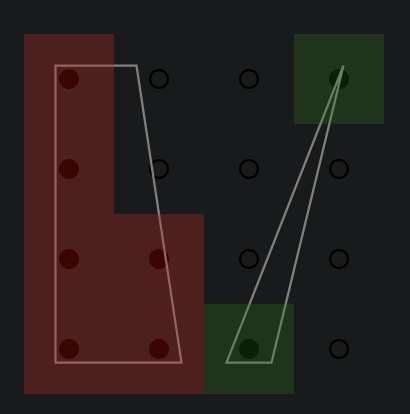
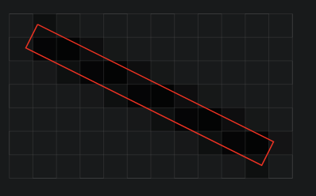

# Pixels

## Rasters

Rasters are rectangular grids of pixels. The rasterization of a scene
is the arrangement of a single color at each pixel. It is the primary
output of 'canvase-style APIs' (the backing for most other graphics
APIs).

A **pixel** is most commonly thought of as a square or as a
mathematical point.

## Aliasing

Aliasing, in graphics (similarly to audio) is when the encoding of
graphics data is misrepresented by the medium.

If we were to use the center of the pixel to determine the color,
we would have a couple of issues.

*Two examples of point-like pixels causing aliasing.

Treating pixels as square regions mitigates these issues.

